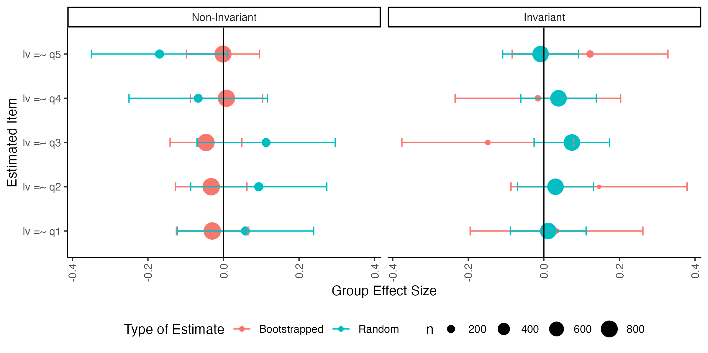
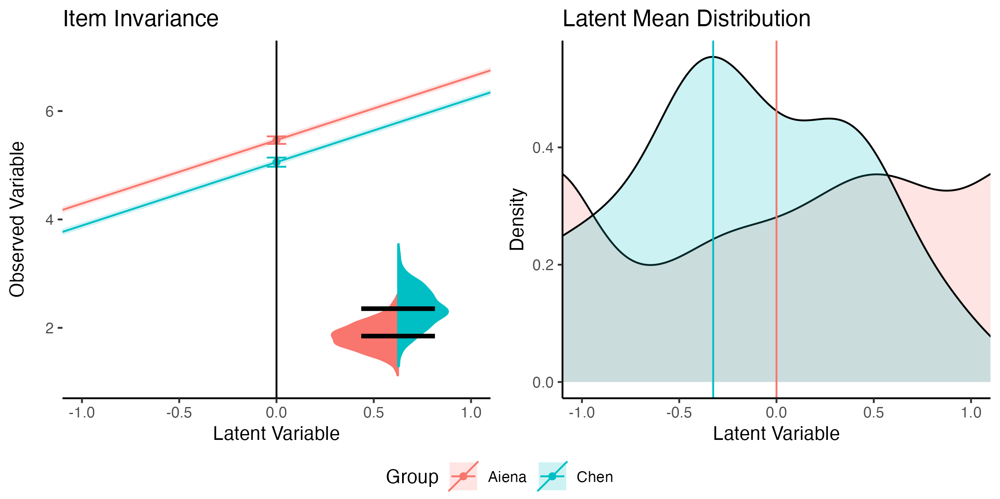

```{r libraries, include = FALSE}
library(papaja)
library(lavaan)
library(broom)
library(dplyr)
library(ggplot2)
library(cowplot)
library(ggridges)
library(tidyr)
library(rio)

# devtools::install_github("psyteachr/introdataviz")
# devtools::install_github("ddueber/dmacs")
# devtools::install_github("doomlab/visualizemi")
library(introdataviz)
library(dmacs)
library(visualizemi)
library(patchwork)

# make smaller outputs
def.source.hook  <- knitr::knit_hooks$get("source")
knitr::knit_hooks$set(source = function(x, options) {
  x <- def.source.hook(x, options)
  x <- ifelse(!is.null(options$size), 
         paste0("\\", options$size,"\n\n", x, "\n\n \\normalsize"), 
         x)
})
```

```{r analysis-preferences}
# Seed for random number generation
set.seed(84393)
knitr::opts_chunk$set(cache.extra = knitr::rand_seed, cache = TRUE, message = FALSE, warning = FALSE)

boot_rr_DF <- import("manu_data/boot_rr_DF.csv")
boot.partial.invariant <- readRDS("manu_data/boot.partial.invariant.RData")
boot.model.rs <- readRDS("manu_data/boot.model.rs.RData")
boot.partial.rs <- readRDS("manu_data/boot.partial.rs.RData")

boot.df.full <- import("manu_data/boot_DF_full.csv")
boot.effects.summary.full <- import("manu_data/boot_effects_summary_DF_full.csv")
boot.partial.summary.full <- import("manu_data/boot_partial_summary_DF_full.csv")
```

Psychological assessments play a critical role in our ability to measure and analyze constructs to support theories and experimental hypotheses. Defining and creating assessments to validly and reliability measure constructs is often difficult because phenomenon, such as anxiety, are often not directly observable. Instead, we use surveys and questionnaires to indirectly assess the underlying construct [@devellis2022]. Latent variable modeling (i.e., structural equation modeling) is a popular tool for the validation of developed survey instruments to verify scale dimensionality, structure, and model fit. A simple search for scale development reveals thousands of articles in psychology that examine new and previously published work, thus, illustrating the interest in both measurement and the use of validation techniques. Unfortunately, except in specialty journals, much of the validity evidence and/or development for measures used in empirical studies is not reported within the journal article [@barry2014; @weidman2017]. Without this information, it is difficult to interpret individual study conclusions, as validity information allows for judgment of usefulness of the measured values [@flake2020]. Further, the current focus on replication [@makel2012; @makel2014; @zwaan2018], reproducibility [@nelson2018], and the credibility of our results [@vazire2022] has demonstrated questionable measurement practices - decisions that researchers make like survey selection and scoring that impact the results of the study [@flake2020]. Transparent reporting of the use and creation of scales can improve both interpretation and reproducibility when using surveys developed to measure latent constructs [@shadish2001].

A secondary concern for developed measures is the potential for differential responding and assessment within target populations. For example, @trent2013 examined for potential variability in the Revised Child Anxiety and Depression Scale in White and Black youths [@chorpita2000]. They found that the scale mostly functioned the same for both White and Black individuals but differences in averages on individual items could potentially affect the scoring and interpretation of the scale results. This comparison of sub-populations is the test of measurement invariance [@meredith1993]. Invariance or equivalence implies that the scale operates in the same fashion for each sub-group, and thus, differences in the final latent variable scores can interpreted as differences in populations. Non-invariance suggests that individuals respond or interpret items differently, and thus, differences in scores may represent different scores on the latent variable in the population or differences in measurement. Non-invariant measurement may lead to misleading results when making group comparisons, and assessing invariance has become a popular technique in scale development [@vandeschoot2015].

Measurement invariance has been explored and implemented for the last fifty years [@jöreskog1971; @sörbom1978] and implemented in the most popular structural equation modeling programs [@jöreskog2001; @rosseel2012; @boker2011]. @byrne1989 extended the ideas of multigroup testing by suggesting partial invariance [followed by @meredith1993]. Partial invariance occurs when non-invariance is found but can be attributed to only a few parameter estimate differences between groups (i.e., items 1 and 2 have different factor loadings but all others are the same). This testing provided an advantage to understand where the potential non-invariance may occur for further study and interpretation guidelines. As the field pushes back against favoring cutoff criteria and rules of thumb [@marsh2004; @putnick2016], an effect size measure for translating "how much" non-invariance was developed $d_{MACS}$ [@nye2011]. This effect size examines the differences in observed variables between the two groups for both the factor loading and the item intercept; thus, any differences in either or both will increase the effect size for non-invariance [@stark2006].

With $d_{MACS}$ and measurement invariance testing, researchers can begin to quantify how and where their construct measurement may vary between groups. Yet, given the large number of studies that show non-invariance, it is clear that equivalence can be hard to meet. It is difficult to know if non-invariance occurs because of random sampling error, true population differences, or differences in replication and reproducibility of the construct in a new sample. The field of psychology is increasingly interested in pre-registration [i.e., registering plans for a study before data collection, @nosek2018] and the promotion of transparency in study design, implementation, and analysis [@mayo-wilson2021], in addition to supporting replication studies [@zwaan2018]. Registered (replication) reports provide an advantageous avenue for the pre-registration of measurement tests, as they allow a researcher the ability to have their study accepted in principle, regardless of the results of a test of construct validity, reliability, or measurement invariance [@hobson2019; @nosek2014]. However, there are few tools that can provide effect size measures for models, individual parameters, or visualization for researchers to plan for future studies. $d_{MACS}$ provides the opportunity to begin to think about the smallest effect size of interest or the smallest meaningful effect size for measurement invariance and replication [i.e., two studies with overlapping confidence intervals "replicate", even if the test of measurement invariance does not, @lakens2017; @anvari2021]. As mentioned, $d_{MACS}$ has only really been explored for a combined intercept and loadings, and while useful, does not necessarily allow a researcher to pinpoint specific issues within an observed variable.

Therefore, purpose of this manuscript is to describe an *R* package, `visualizemi`, that provides functionality to calculate multigroup confirmatory factor analysis, partial invariance tests, visualizations of the size of non-invariance, and potential effect sizes for overall models and individual parameters. No known visualization techniques have been proposed for measurement invariance. By creating panel visualizations, we can supplement a researcher's ability to judge the strength of the non-invariance differences and effect size for each item. The proposed effect sizes demonstrate the likelihood of replication with a similar sample as compared to a randomly assigned group model, thus, illustrating what type of measurement one might expect to find, and how different that is from random chance. Within this technique, the individual parameter effect sizes can be calculated: both the group differences within a model as compared to random and the likelihood of a parameter replication compared to random groups. Coupled with other indicators (i.e., fit indices differences, $d_{MACS}$), we can move toward a better understanding of how much measurement non-invariance is meaningful. This tutorial and package will help researchers plan future studies and aid in the ability to estimate a smallest effect of interest for measurement invariance studies, rather than relying on fit indices and rules of thumb alone.

By the end of this tutorial manuscript, readers will:

1.  Learn how to use *visualizemi* to analyze multigroup confirmatory factor analysis, examine partial for invariance, and create visualizations of parameters.
2.  Learn how to estimate the potential replication of multigroup models and their parameters using bootstrapping compared to a random group model.
3.  Be able to calculate and interpret effect sizes for model and parameter replication, as well as parameter group differences.
4.  Understand the impact of measurement variability on replication and generalizability.

The tutorial will start with a general overview of relevant topics to orient readers to invariance testing and MGCFA effect sizes. Next, the reader will learn about the `visualizemi` package functions for 1) running the multigroup analysis, 2) running a partial invariance analysis, 3) plotting the partial invariance, 4) estimating replication and effect sizes at the model level, and 5) estimating replication and effect sizes at the parameter level. Last, data from @aiena2014 and @chen2020 examining the measurement invariance of the RS-14 [@wagnild2009] will be used to demonstrate the application of the package on real data. The *visualizemi* package vignette includes an additional tutorial walk through.

# Terminology

## MGCFA

Multigroup confirmatory factor analysis (MGCFA) was proposed as a method to examine differences in scale functioning across groups [@brown2015] using structural equation modeling and confirmatory factor analysis (CFA). The goal of MGCFA is to determine if groups are invariant or show the same response patterns on the scale. MGCFA is often performed in sequential steps to determine the location and impact of potential non-invariance. The most common procedure starts by examining overall scale structure for each group individually to show that the groups can be combined into one nested model (i.e., both models at least converge). The combined model, often described as the *configural* model, creates one CFA for both groups that allows each group's estimated parameters to vary. Equality constraints between group parameters are then added sequentially to the model [@brown2015]. If parameters are found to be equivalent between groups, these models are considered "invariant", suggesting that any subtle differences in the parameter estimates should not effect overall scoring and assessment.

The first equality constraint added is usually the item factor loadings (*metric* model) which requires items to be related to the latent variable at the same strength across groups. The intercepts are then constrained to be equal across groups (*scalar* model) to determine the invariance of item averages. The item variances (*strict* model) can then be examined to determine if the general variation in item answers are equal across groups. Other parameter equality constraints can be set at the latent variable level (latent means, variance, covariances), but the focus is generally on the observable variables and their parameter estimations. Non-invariance is determined by examining differences in fit indices between models with constraints versus without in sequential order [@cheung2002].

## Partial Invariance

If a specific step within the MGCFA testing framework shows non-invariance, partial invariance is often used to investigate where and "how much" invariance occurs [i.e., how many items, rather than how big the differences are @byrne1989; @meredith1993]. Similar to *post hoc* follow up tests in ANOVA, each equality constraint for that model is examined one at a time by allowing groups to vary. If the model fit improves when groups are allowed to have separate parameter estimates, the item for these groups is considered non-invariant. When only a few parameters are found that impact invariance, models are considered partially invariant, implying that most, but not all parameters are equal across groups. The researcher then interprets the impact of those items and parameters on overall scores and assessment usefulness. Partial invariance investigation is a useful tool for finding specific items that vary between groups, but does not fully explain the effect size of the difference between groups on those items and the impact on the overall model.

## Effect Size: $d_{MACS}$

$d_{MACS}$ was developed from Differential Item Functioning (DIF) measurement in Item Response Theory [IRT, @stark2004] wherein the effect size (DIF) portrays the group differences that lead to overall item score differences. Item scores can be mathematically defined as:

$$
\hat{X}_{iR} = \tau_{iR} + \lambda_{iR}\xi
$$

*i* indicates an individual item, and *R* indicates the reference group [@nye2011]. Therefore, an individual item is predicted by the intercept of the item ($\tau$) added to the item loading ($\lambda$) times the latent variable score ($\xi$). @nye2011 demonstrated that the terminology and equations from IRT and DIF can be used to create a measure of item functioning differences within CFA, $d_{MACS}$. $d_{MACS}$ is then the difference of reference group versus focal group (e.g., group 1 versus group 2) divided by a pooled standard deviation similar to formulas for *d* proposed by @cohen2013. Therefore, if $\tau$ or $\lambda$ are individually (or both) different across groups, it will impact all the predicted $X_{iR}$ scores, and thus, impact $d_{MACS}$ values. While $d_{MACS}$ represents a necessary step for development of effect sizes within CFA, it does not separate the differences in parameters between groups in a way that can be paired with traditional MGCFA testing steps and partial invariance. In addition to the missing effect sizes at model and parameter levels, no effect size to date gives the researcher a feeling for potential replication of the invariant or non-invariant items. Last, in line with general suggestions by @cumming2012 and @cumming2016, the visualization of effect sizes in MGCFA would be an added tool for researchers to gauge the size of group differences.

# Package Functions

The code for this manuscript can be found at <https://osf.io/wev5f/>. This tutorial was registered at <https://osf.io/vwf4d>, and the example provided at the end of the manuscript was added after that registration. The *R* package and replication/effect sizes was added after the original manuscript submission. The simulation study used to design plotting functions and test effect sizes can be found in the supplemental materials, along with worked code examples.

## MGCFA: `mgcfa()` Function

First, we would create our model code in *lavaan* syntax [@rosseel2012]. The *visualizemi* package does generally require raw data for bootstrapping purposes, and an example of how to simulate data from models and covariance/correlations tables that sometimes are provided in manuscripts (rather than the raw data) is provided in the supplemental documentation. The `mgcfa()` function is designed to flexibly allow you to leverage *lavaan*'s package functions to calculate multiple measurement steps at once. You would include:

1)  the model syntax in the `model` argument.
2)  the dataframe in the `data` argument of our function
3)  the name of the grouping variable in quotes for `group`.
4)  and the equality constraints you would like to impose in order in `group.equal`.
5)  `...` any other *lavaan* arguments you would like to use such as `meanstructure` or `estimator`.

The following output is saved:

1)  `model_coef`: The parameter estimates for each model with the model step included in a *model* column. This set of coefficients can be used for other functions. This dataframe is created with *broom*'s `tidy()` function if you wish to recreate this table without running the `mgcfa()` function [@robinson2023].
2)  `model_fit`: The model fit indices from `fitmeasures()` to review for overall model fit and invariance judgments. The name of the model is included in a *model* column.
3)  `model_overall`: A saved *lavaan* fitted model of all groups together without any equality constraints or grouping variables. These objects can be used with any function that normally takes a saved model: `parameterEstimates()`, `modificationIndices()`, `semPlot::semPaths()`, and so on [@epskamp2022].
4)  `group_models`: A list of saved fitted models for each group separately.
5)  `model_configural`: A saved fitted model for the configural model that nests together each group into one model with no other constraints.
6)  `invariance_models`: A list of saved fitted models that consecutively adds `group.equal` constraints.

## Partial Invariance: `partial_mi()` Function

The `partial_mi()` function aids in the calculation of partial invariance for a specific step of the MGCFA process. The function includes the following arguments:

1)  `saved_model`: The saved *lavaan* model with the equality constraints at the level of measurement invariance you would like to examine for partial invariance.
2)  `data`: The dataframe where the model was estimated.
3)  `model`: The model syntax for the overall model.
4)  `group`: The grouping variable column in the dataframe.
5)  `group.equal`: The equality constraints including in your original multigroup tests.
6)  `partial_step`: The level of partial invariance you wish to test.

In this function, each parameter with the appropriate *lavaan* syntax is relaxed individually (i.e., `~1` for intercepts, `~~` for residuals, etc.). The fitted models are saved in the `models` output, and the `fit_table` output includes all fit indices for each model to investigate potential areas of partial invariance based on the researcher's desired criterion. 

## Visualization of Invariance: `plot_mi()` Function

Once we know which items are non-invariant, the `model_coef` output from the `mgcfa()` can be used directly in `plot_mi()`. The plot outputs will be described below. First, here are the arguments for the function:

1)  `data_coef`: A tidy dataframe of the parameter estimates from the models. This function assumes you have used `broom::tidy()` on the saved model from *lavaan* and added a column called "model" with the name of the model step [@robinson2023]. This function will only run for models that have used the grouping function (i.e., configural, metric, scalar, and strict or other combinations/steps you wish to examine).
2)  `model_step`: Which model do you want to plot? You should match this name to the one you want to extract from your model column in the `data_coef`.
3)  `item_name`: Which observed variable from your model syntax do you want to plot? Please list this variable name exactly how it appears in the model.
4)  `x_limits`: What do you want the x-axis limits to be for your invariance plot? The default option is to assume the latent variable is standardized, and therefore, -1 to 1 is recommended. Use only two numbers, a lower and upper limit. This value also constrains the latent mean diagram to help zoom in on group differences because the scale of latent means is usually centered over zero. You can use this parameter to zoom out to a more traditional histogram using `c(-2, 2)`.
5)  `y_limits`: What do you want the y-axis limits to be for your invariance plot? Given that the latent variable is used to predict the observed values in the data, you could use the minimum and maximum values found in the data. If that range is large, consider reducing this value to be able to visualize the results (i.e., otherwise it may be too zoomed out to judge group differences). Use only two numbers, a lower and upper limit.
6)  `conf.level`: What confidence limit do you want to plot? Use 1 - $\alpha$.
7)  `model_results`: In this argument, include the saved *lavaan* output for the model listed in the `model_step` argument.
8)  `lv_name`: Include the name of the latent variable, exactly how it is listed in your *lavaan* syntax. You should plot the latent variable that the `item_name` is linked to. If you have items that load onto multiple latent variables, you will need to make multiple plots.
9)  `plot_groups`: If you include more than two groups in a multigroup model, the automatic assumption is that you want the first two groups for this visualization. If not, include the names of the groups here to plot.

The outputs from this function are several *ggplot2* objects that can be edited or saved directly using *ggplot2* functionality [@R-ggplot2].

1)  `complete`: The output from this model can be found in Figure \@ref(fig:invariant-pic). On the left-hand side, the item invariance is plotted, and on the right-hand side, the latent mean distributions for the two groups are plotted. In the item invariance sub-plot, the visualization includes all three components traditionally seen in MGCFA testing steps: loadings, intercepts, and residuals. Each visualization element was designed to match the traditional visualization for that type of output. All parameter estimates are plotted on the unstandardized estimates and their confidence interval based on the standard error of the estimate. All plots are made with *ggplot2* and *cowplot* [@wilke2020].

```{r invariant-pic, include = T, fig.cap = "Invariant model visualization demonstrating the components of the `plot_mi()` function in *visualizemi*.", fig.height=8}

```

2)  `intercept`: Only the left-hand side of the complete plot designed to represent intercepts and factor loadings. Factor loadings represent the slope of the regression equation for the latent variable predicting the scores on the observed variable ($\hat{Y} \sim b_0 + b_1X + \epsilon$). The y-axis indicates the observed variable scores, and here, the plot includes the entire range of the scale of the data this simulated item. The ribbon bands around the plotted slopes indicate the confidence interval for that estimate. In this plot, while the coefficients for each group are not literally equal, the overlapping and parallel slope bands indicate they are not different practically.

The item intercepts ($b_0$) are plotted on the middle line where they would cross the y-axis at a latent variable score of zero. These are represented by a dot with a set of confidence error bars around the point. In this invariant depiction, the overlap in the intercepts is clear, indicating they are not different. You can use `y_limits` to zoom in on the graph if these are too small to be distinguishable.

3)  `mean`: The right-hand side of the complete plot graphing the latent variable means and density from the data. The latent variable is shown on the x-axis using standardized values (i.e., *z*-scores) where -1 indicates one standard deviation below the mean for the latent variable, 0 indicates the mean for the latent variable and so on. The lines indicate the means of the latent variables from the simulated dataset. Group labels are represented in the figure caption on the bottom. Group 1 is usually the group that is alphabetically first in the data set or whichever group is the first that appears when using the `levels()` command.

4)  `variance`: A split geom violin plot indicating the variance distribution of the plotted item. Residuals are trickier to plot, as they are the left over error when predicting the observed variables $\epsilon$. It is tempting to plot this value as the confidence band around the slope, however, that defeats the purpose of understanding that the slopes are estimated separately from the residuals, and both have an associated variability around their parameter estimate. Therefore, residuals are represented in the inset picture at the bottom right of the item invariance plot. The black bars represent the estimated residual for each group. The distributions are plotted to represent the normal spread of values using the standard error of the residuals. The violin plot allows for direct comparison of those residuals and their potential distributions. Note that the placement has nothing to do with the x or y-axis and is designed to always show in the same location, regardless of size/value. The plots are included separately so they can be arranged in a different fashion if desired.

## Model Replication and Effect Sizes: `bootstrap_model()` Function

The `bootstrap_model` function in *visualizemi* was designed to estimate the likely replication of overall model invariance with the assumption that the data used for the estimation represents the larger population. The following arguments are used:

1)  `saved_configural`: a saved fitted model at the configural level with no equality constraints. This model should include all other lavaan settings you would like to use, such as estimator or ordered.
2)  `data`: The dataframe where the model was estimated.
3)  `model`: The model syntax for the overall model.
4)  `group`: The grouping variable column in the dataframe.
5)  `nboot`: The number of bootstraps to run.
6)  `invariance_index`: The fit index you would like to use to determine invariance. Please use options and labeling from *lavaan* - see `fitmeasures()` for options.
7)  `invariance_rule`: The invariance difference score you would like to use as your rule.
8)  `group.equal`: The equality constraints including in your original multigroup tests.

The data included in this function will be sampled, with replacement, at the same size as the current dataset, and the included invariance equality constraints are estimated. Each step will be compared to the previous step using the invariance index and comparison rule entered. The output is a dataframe of the proportion of non-invariant bootstraps from the real data and the same bootstrapped dataset with the group labels randomly assigned. The effect size comparison of proportions, $h$, for non-invariant comparisons:

$$h_{nmi} = 2 \times (asin\sqrt{p_{data}} - asin\sqrt{p_{random}})$$

The alternative, $h_{mi}$, for effect size of measurement invariance replication would simply be the inverse sign of $h_{nmi}$ and is also included in the table. Two additional columns $h_{nmi_p}$ and $h_{nmi_p}$ represent the $h$ values divided by the upper bound of $h$ (i.e., $\pi$), to help with interpretation of the effect size (thus, bounding $h$ to -1 to 1).

## Parameter Replication and Effect Sizes: `bootstrap_partial()` Function

After examining the overall model potential replication effect size, the individual parameters within a model can be bootstrapped for partial invariance to with that parameter relaxed (overall partial model statistics) and the difference in group parameter estimates (parameter effect size). This function uses arguments seen in other functions, so they will not be repeated here. The general setup consists of using the model you think could be partially invariant in the `saved_model` argument and the fit index for comparison for the model with less constraints in `invariance_compare`. The `partial_step` argument will be used to determine which operation syntax (i.e. `=~` for loadings) to relax for modeling.

The saved output includes several dataframes and plots. The first is the `boot_DF` which is the summary of each bootstrapped run in a dataframe for plotting or summarization. This dataframe includes the estimate for each parameter (`term`) separated by group and type (`boot_1`, `boot_2` are the bootstrapped estimates for group 1 and group 2, while the same `random` columns indicate the randomly assigned groups). The fit index used to determine invariance is included for bootstrapped and random estimates, and then the differences between groups and if they were "invariant" or not given the researcher supplied rule.

Next, the `boot_summary` includes a summarized form of the bootstrapped results separated by bootstrapped data versus randomized data and then invariant/non-invariant outcomes. The $d_s$ for between groups Cohen's $d$ is included [@lakens2013]. Effect sizes are only calculated when the number of bootstrapped estimates is at least 10% of the data - therefore, you would not receive effect sizes with almost no bootstrapped runs. This dataframe should be used to determine which parameter may be different and the effect size potential between groups in a replication of the study. The `boot_effects` table creates a summary similar to the overall model replication table based on the proportion of runs that were considered invariant versus not for each parameter. 

Plots of the results from dataframes can be found within the `bootstrap_partial()` function. Figure \@ref(fig:invariance-partial-fig) shows the difference between parameters for groups in the bootstrapped and randomly assigned group runs in simulated data. Figure \@ref(fig:density-partial-fig) shows the density plot of the estimates for each group organized by bootstrapped and randomly assigned groups and the invariance decision for each bootstrapped run. Last, Figure \@ref(fig:effect-partial-fig) indicates the $d_s$ value between groups with an indication of the number of data points in each estimate (i.e., dot size). These visualizations should allow a researcher to understand the likelihood of replication for each parameter, as well as the potential size of the differences. Therefore, one could indicate a specific smallest effect size of interest, rather than a invariance cut-off rule of thumb when planning a replication or registered report.

```{r invariance-partial-fig, include = T, fig.cap = "Visualization of the difference score between groups by parameter for invariant and non-invariant bootstrapped and randomly assigned group data on simulated data.", fig.height=8}

```

```{r density-partial-fig, include = T, fig.cap = "Visualization of the number of estimates for each group by bootstrapped and randomly assigned group runs by their invariance decision on simulated data.", fig.height=8}

```

```{r effect-partial-fig, include = T, fig.cap = "Visualization of effect size between groups by parameter for invariant and non-invariant bootstrapped and randomly assigned group data. The size of the dots indicate the number of data points for that estimate.", fig.height=8}

```

# An Example Analysis

```{r grab-data, eval = F, include = F}
library(rio)

DF <- bind_rows(
  import("data/Adult CFA.sav") %>% dplyr::select(-Age) %>% 
    mutate(sample = "Clinical"),
  import("data/Adult EFA.sav") %>% dplyr::select(-Age) %>% 
    mutate(sample = "Clinical"),
  import("data/Student CFA.sav") %>% dplyr::select(-Age) %>% 
    mutate(sample = "Student"),
  import("data/Student EFA.sav") %>% dplyr::select(-Age) %>% 
    mutate(sample = "Student")
) %>% dplyr::select(RS1:RS14, sample)

save(DF, file = "RS14.Rdata")
```

@aiena2014 examined the RS-14 [@wagnild2009] exploring the factor structure of the Resiliency Scale in a clinical sample receiving treatment services and a college student sample. Measurement invariance was calculated for differences separately for these samples for gender and race finding a partially invariant models with a few item intercepts or residuals that differed between groups. @aiena2014 did not compare the clinical to the student sample for measurement invariance, and it is reasonable to expect potential differences in these two populations. This example will demonstrate the procedure for researchers who wish to use partial invariance steps and how to interpret real, messy data.

```{r load-RS, echo = F, include = T, size = "small"}
# load the data, it is called DF
load("manu_data/RS14.Rdata")

# build the one-factor model 
model.rs <- "RS =~ RS1+RS2+RS3+RS4+RS5+RS6+RS7+RS8+RS9+RS10+RS11+RS12+RS13+RS14"
# run the multigroup CFA
results.rs <- mgcfa(
  model = model.rs,
  data = DF, 
  group = "sample", 
  group.equal = c("loadings", "intercepts", "residuals")
  )
```

```{r show-rs-results, eval = F, echo = F, include = F, size = "small"}
# how to get results in table 
results.rs$model_fit %>% 
        dplyr::select(model, AIC, BIC, cfi, tli, rmsea, srmr)
```

```{r rs-table, results = 'asis'}
apa_table(results.rs$model_fit %>% 
        dplyr::select(model, AIC, BIC, cfi, tli, rmsea, srmr) %>% 
          mutate(model = tools::toTitleCase(model)), 
        digits = 3, 
        col.names = c("Model", "AIC", "BIC", "CFI", "TLI", "RMSEA", "SRMR"),
          caption = "Model Fit for RS-14 Example")
```

Table \@ref(tab:rs-table) indicates the results after running the one-factor model. There are several guidelines for assessing assessing a degradation in model fit [@cheung2002; @jin2020; @putnick2016; @counsell2020; @cao2022] but for the purposes of this illustration $\Delta$CFI \> .01 will be used. Table \@ref(tab:rs-table) indicates that fit was degraded when the constraint on equal item intercepts was added. The code online provides an example of testing each item individually by relaxing the constraints and recalculating the CFI. If these items bring the CFI value back up to $\Delta$CFI \<= .01 from the metric model, then the model would be considering partially invariant at the scalar level. It seems unlikely that the residuals will show invariance, even if partial scalar invariance can be found, as the drop in fit on the residual model is quite large.

```{r partial-RS, echo = F, include = F, size = "small"}
partial.rs <-
  partial_mi(
    saved_model = results.rs$invariance_models$model.intercepts,
    data = DF,
    model = model.rs,
    group = "sample",
    # be sure to do only up to the step you are interested in
    group.equal = c("loadings", "intercepts"),
    partial_step = "intercepts")

partial.rs$fit_table %>% 
  dplyr::select(free.parameter, cfi)
```

```{r partial-RS7, echo = F, include = F, size = "small"}
# run the partially invariant model with group.partial
partial.rs.1 <- mgcfa(model = model.rs, 
                  data = DF, 
                  group = "sample", 
                  group.equal = c("loadings", "intercepts"),
                  group.partial = c("RS7~1"),
                  meanstructure = TRUE)

# examine the loadings 
partial.rs.1$model_coef %>% 
  filter(term == "RS7 ~1 ") %>% 
  filter(model == "intercepts") %>% 
  dplyr::select(term, group, estimate, std.error)

# examine the fit indices 
partial.rs.1$model_fit %>% 
  filter(model == "intercepts") %>% 
  dplyr::select(AIC, BIC, cfi, tli, rmsea, srmr)

# effect size model 
lavaan_dmacs(partial.rs.1$invariance_models$model.intercepts, "Clinical")$DMACS[7]
```

```{r partial-RS6, echo = F, include = F, size = "small"}
# add the second intercept
partial.rs.2 <- mgcfa(model = model.rs, 
                  data = DF, 
                  group = "sample", 
                  group.equal = c("loadings", "intercepts"),
                  group.partial = c("RS7~1", "RS6~1"),
                  meanstructure = TRUE)

# examine the loadings 
partial.rs.2$model_coef %>% 
  filter(term == "RS6 ~1 ") %>% 
  filter(model == "intercepts") %>% 
  dplyr::select(term, group, estimate, std.error)
# examine the fit indices 
partial.rs.2$model_fit %>% 
  filter(model == "intercepts") %>% 
  dplyr::select(AIC, BIC, cfi, tli, rmsea, srmr)

# effect size model 
lavaan_dmacs(partial.rs.2$invariance_models$model.intercepts, "Clinical")$DMACS[6]
```

The partial invariance results indicated that RS6 and RS7 are potential items that could be relaxed to improve model fit and create a partial scalar invariant model (i.e., by picking the largest CFI values). By examining our estimates, we can see that item seven on the RS-14 is estimated at nearly 5 points for the clinical sample, while the student sample has a lower mean around 4.5 points. Generally, students show higher means on the items of the RS-14, but when all loadings and other intercepts are constrained to be equal, and this one item is relaxed, this pattern flips so that clinical groups show higher item intercepts. Given the scale is a 1-7 Likert type scale, .5 a point represents a potentially sizable change on the scale. Item seven covers perseverance after hardship, and all items can be found in the user manual for the scale at www.resiliencecenter.com. The effect size from $d_{MACS}$ suggests a small to medium effect, `r apa_num(lavaan_dmacs(partial.rs.1$invariance_models$model.intercepts, "Clinical")$DMACS[7])`. See Figure \@ref(fig:rs7-img) for the difference between item intercepts and latent means. We repeat this process for the RS6, as the CFI for our model with only RS7 does not achieve the levels of partial invariance for our $\Delta$CFI criterion (i.e., \<= .01 downward change in fit: metric CFI = `r apa_p(results.rs$model_fit$cfi[5])`, partial scalar CFI = `r apa_p(partial.rs.1$model_fit$cfi[6])`). Again, we see about a half-point difference between our clinical and student samples for item 6, which is about drive to achieve. The CFI for this model does meet the requirements for partial invariance, `r apa_p(partial.rs.2$model_fit$cfi[6])`. The effect size is approximately the same at $d_{MACS}$ = `r apa_num(lavaan_dmacs(partial.rs.2$invariance_models$model.intercepts, "Clinical")$DMACS[6])`. See Figure \@ref(fig:rs6-img) shows the difference between item intercepts and latent means.

```{r plot-RS7, include = F, echo = F, results = "small", eval = F}
# plot the image for RS7
plot_mi(
  data_coef = partial.rs.2$model_coef, 
  model_step = "intercepts", 
  item_name = "RS7", 
  x_limits = c(-1,1),
  y_limits = c(min(DF$RS7), max(DF$RS7)),
  conf.level = .95, 
  model_results = partial.rs.2$invariance_models$model.intercepts,
  # which latent variable do you want 
  lv_name = "RS" 
)$complete
```

```{r rs7-img, echo = F, include = T, size = "small", fig.cap="RS7 item non-invariance visualization showing differences in the item intercepts and latent variable.", fig.height=8}
# plot the image for RS7
plot_mi(
  data_coef = partial.rs.2$model_coef, 
  model_step = "intercepts", 
  item_name = "RS7", 
  x_limits = c(-1,1),
  y_limits = c(min(DF$RS7), max(DF$RS7)),
  conf.level = .95, 
  model_results = partial.rs.2$invariance_models$model.intercepts,
  # which latent variable do you want 
  lv_name = "RS" 
)$complete

ggsave("figures/rs7-visual.png", dpi = 300, 
       width = 8, 
       units = "in")
```

```{r plot-RS6, include = F, echo = F, results = "small", eval = F}
# plot the image for RS6
plot_mi(
  data_coef = partial.rs.2$model_coef, 
  model_step = "intercepts", 
  item_name = "RS6", 
  x_limits = c(-1,1),
  y_limits = c(min(DF$RS6), max(DF$RS6)),
  conf.level = .95, 
  model_results = partial.rs.2$invariance_models$model.intercepts,
  # which latent variable do you want 
  lv_name = "RS" 
)$complete
```

```{r rs6-img, echo = F, include = T, size = "small", fig.cap="RS6 item non-invariance visualization similar results to RS7 with differences in item intercepts.", fig.height=8}
plot_mi(
  data_coef = partial.rs.2$model_coef, 
  model_step = "intercepts", 
  item_name = "RS6", 
  x_limits = c(-1,1),
  y_limits = c(min(DF$RS6), max(DF$RS6)),
  conf.level = .95, 
  model_results = partial.rs.2$invariance_models$model.intercepts,
  # which latent variable do you want 
  lv_name = "RS" 
)$complete

ggsave("figures/rs6-visual.png", dpi = 300, 
       width = 8, 
       units = "in")
```

Next, we would examine our replication potential for this model. Given our current results, we may not expect our intercepts to replicate. Given the order of desired steps in the  `group.equal` argument, the boot function will select the first non-invariant step (as defined by the user) in the calculation of the effect size for potential replication. In our output, we do not see a loadings effect size, and this result occurs when *none* of the bootstrapped or random results are non-invariant. Therefore, we would expect the loadings to replicate (and the effect size would be 0 difference between bootstrapped and random, both showing invariance). The intercepts show a large (i.e., close to the max possible value) non-invariant effect, $h_{nmi}$ = `r apa_num(boot.model.rs$h_nmi[1])` ($h_{mni}_p$ = `r apa_num(boot.model.rs$h_nmi_p[1])`), and therefore, we should not expect this model to show invariance in a replication.

```{r model-boot-RS, include = F, echo = F, results = "small", eval = F}
boot.model.rs <- 
  bootstrap_model(
    saved_configural = results.rs$model_configural,
    data = DF,
    model = model.rs, 
    group = "sample", 
    nboot = 1000, 
    invariance_index = "cfi",
    invariance_rule = .01, 
    group.equal = c("loadings", "intercepts", "residuals")
)
saveRDS(boot.model.rs, "manu_data/boot.model.rs.RData")
```

```{r model-boot-RS-out, include = F, echo = F, results = "small"}
boot.model.rs
```

Next, we would examine the strength of the effects of replication on each parameter at the intercept level. By examining Table \@ref(tab:table-boot-effects), it is clear that most of the item means are unlikely to replicate, even though two particular items can be used to create partial invariance. Figures \@ref(fig:rs-partial-pic) and \@ref(fig:rs-partial-pic2) display the three plots provided in the `bootstrap_partial()` function. In general, we should expect $M_{D}$ = `r apa_num(boot.partial.rs$boot_summary %>% filter(invariant) %>% pull(mean_boot_difference) %>% mean())` when items are invariant and $M_{D}$ = `r apa_num(boot.partial.rs$boot_summary %>% filter(!invariant) %>% pull(mean_boot_difference) %>% mean())` when items are not invariant. The effect size of non-invariant items ranges from $d_s$ ~ `r apa_num(boot.partial.rs$boot_summary %>% filter(!invariant) %>% pull(d_boot) %>% min(., na.rm = T))` to `r apa_num(boot.partial.rs$boot_summary %>% filter(!invariant) %>% pull(d_boot) %>% max(., na.rm = T))`.

The density plot shown at the bottom of Figure \@ref(fig:rs-partial-pic) illustrates the likely reasons for the differences found in the top plots. It appears that many items show a bimodal distribution within group 1 (Clinical Sample) and when items are invariant, the intercept averages to the same intercept as group 2 (Student Sample). In non-invariant estimates, the same bimodal distributions are found, but they are more extreme than the student samples, and therefore, item show different averages due to the presence of two separate means of data. Further, some items also appear to show two separate student item averages within the data. This result suggests that it would be fruitful to understand a potential predictor of these differences or other confounding variable that separates these samples, creating differences in item averages.

In summary, if one were planning a replication, the prediction would be that item intercepts would likely not replicate, with a large effect size (i.e., it is easy to judge $h_{nmi_p}$ close to the max of one as large). While this study found partial invariance by relaxing constraints on two individual items, bootstrapped partial invariance indicates that any item could potentially be problematic with an effect size averaging $d_s$ \~ 0.50 difference in means. While $d_{MACS}$ values represented a "small" effect based on previous publications, this effect may be muted by examining both loadings and intercepts. The results here suggest that the effect is driven by intercepts. The overall average score on items is high: $M_M$ = `r apa_num(mean(apply(DF[ , -ncol(DF)], 2, mean)))` ($M_{SD}$ = `r apa_num(mean(apply(DF[ , -ncol(DF)], 2, sd)))`). Given the mean and standard deviation, a $d_s$ \~ 0.50 represents `r apa_num(mean(apply(DF[ , -ncol(DF)], 2, sd))/2)` or nearly one whole point on the scale. A researcher could decide that at least $d_s$ = 0.33 or at least a third of a standard deviation would be an important change and set that as their smallest effect size of interest for invariance replication and extension. Further, a newly planned study should investigate what variables may predict when and why samples separate into bimodal representations for item means.

```{r partial-boot-RS, include = F, echo = F, results = "small", eval = F}
boot.partial.rs <- 
  bootstrap_partial(
    saved_model = results.rs$invariance_models$model.intercepts,
    data = DF,
    model = model.rs, 
    group = "sample", 
    nboot = 1000, 
    invariance_index = "cfi",
    invariance_rule = .01, 
    invariance_compare = fitmeasures(results.rs$invariance_models$model.loadings, "cfi"), 
    partial_step = "intercepts",
    group.equal = c("loadings", "intercepts")
)
```

```{r}
# saveRDS(boot.partial.rs, "manu_data/boot.partial.rs.RData")
boot.partial.rs <- readRDS("manu_data/boot.partial.rs.RData")
```

```{r table-boot-effects, results='asis'}
apa_table(boot.partial.rs$boot_effects %>% 
            dplyr::select(term, non_invariant, random_non_invariant, h_nmi, h_nmi_p) %>% 
            mutate(term = gsub("~1", " Intercept", term)),
          col.names = c("Term", "Non-Invariant", "Random Non-Invariant", 
                        "$h_{nmi}$", "$h_{nmi_p}$"),
          escape = F,
          digits = 3, 
          caption = "Boot Partial Effects Results for RS-14 Intercepts",
          note = "Non-Invariant and Random Non-Invariant columns represent the proportion of non-invariant simulations of out the total simulations, representing our non-replication rate. These values are converted into an effect size difference in the final two columns.")
```

```{r rs-partial-pic, include = T, fig.cap="RS-14 scale invariance for item intercepts. The left panel indicates the raw score difference between groups and items, while the right panel indicates the effect size for group differences based on invariance."}

get_legend <- function(plot, legend = NULL) {

    gt <- ggplotGrob(plot)

    pattern <- "guide-box"
    if (!is.null(legend)) {
      pattern <- paste0(pattern, "-", legend)
    }

    indices <- grep(pattern, gt$layout$name)

    not_empty <- !vapply(
      gt$grobs[indices],
      inherits, what = "zeroGrob",
      FUN.VALUE = logical(1)
    )
    indices <- indices[not_empty]

    if (length(indices) > 0) {
      return(gt$grobs[[indices[1]]])
    }
    return(NULL)
  }

legend_all <- get_legend(boot.partial.rs$effect_invariance_plot +
                           theme(legend.direction = "horizontal",
                                 legend.justification="center",
                                 legend.box.just = "bottom"))

(boot.partial.rs$invariance_plot + theme(legend.position = "none") + boot.partial.rs$effect_invariance_plot + theme(legend.position = "none")) /  
  legend_all

ggsave("figures/rs-boot-partial.png", dpi = 300, 
       width = 8, 
       units = "in")
```

```{r rs-partial-pic2, include = T, fig.cap = "RS-14 scale invariance density plots, illustrating invariant versus non-invariant bootstrapped and random runs for each parameter."}
suppressMessages((boot.partial.rs$density_plot))

ggsave("figures/rs-boot-density.png", dpi = 300, 
       width = 8, 
       units = "in")
```

# An Example Extension

One benefit of the open science movement on scale development is the publication of datasets or covariance tables with published articles. We can extend our examination of potential replication on other variables that may effect assessment of underlying phenomena. For example, scale translation across languages is not only impacted by the literal conversion of concepts from one language to another, but also the cultural and societal norms of the target population [@cha2007; @yu2004; @chang1999]. The RS14 was tested in Chinese speaking samples in @chen2020 across five different large samples and determined that the scale showed good psychometric properties for use within Chinese speaking samples as a one-factor model of resiliency. Given these results, another researcher may assume that the models would be comparable between English speaking (i.e., likely United States) and Chinese speaking samples. With the published data, we can use *visualizemi* to determine if the RS14 is invariant across language/culture, and if the results would likely replicate if tested on a new set of samples, and what, if any, effect size differences are found in parameters. The code used for this analysis is presented in the supplemental materials.

The @aiena2014 data used in our previous example was first filtered to only college students, as we have already noted that clinical samples show slightly different intercepts for at least two of the items from student samples. The @chen2020 data also included college students, which allows us to test a comparable sample that varies on translation and culture. The test of measurement invariance indicated that the factor structure and loadings were invariant across groups. Much like our test of clinical versus student samples, the results indicated that the intercepts were not consistent across groups. Within the English clinical/student sample, partial invariance could be achieved by relaxing two item intercept constraints (item 6 and 7). To achieve "partial" invariance between the Chinese and English speaking samples, we would need to relax more than half of the items (specifically, eight items: 1, 2, 3, 4, 10, 11, 12, 14), and it would be difficult to suggest partial invariance given this finding. $d_{MACS}$ values range from 0.26 to 0.32 for the eight items which could be interpreted a small to medium given @nye2019's simulation study. Figure \@ref(fig:rs14-chinese-pic) portrays the results from the second item on the RS14 (*life accomplishments*).

The results of model bootstrapping indicated that the effect of the loadings was likely to replicate (only invariant results were found), but the intercepts were never found to be invariant compared to a randomized sample ($h_{nmi_p}$ = 1). Therefore, we would expect that these differences are persistent, either due to the adaptation or cultural differences in resiliency across samples. The bootstrapped partial invariance demonstrates that each item intercept has a medium to large difference between the two samples as shown in Figure \@ref(fig:rs14-chinese-effect-pic), which may explain why full or partial invariance cannot be achieved. This result does not invalidate either version of the scale, but informs researchers of potential baseline differences in item responding for the two samples. Therefore, careful interpretation should be made when comparing these two samples in other instances, as differences in latent means may be the default finding, but with these results one may determine if their results are different from expectations of general scale responding.

```{r rs14-chinese-pic, include = T, fig.cap = "The differences in intercepts for the second item on the RS14 by language sample. The differences between intercepts are shown on the left-hand side with a clear separation between lines. The latent means also show a clear difference between groups where the English group appears to have lower scores overall than the Chinese group.", fig.height=8}

```

```{r rs14-chinese-effect-pic, include = T, fig.cap = "Effect size differences for item intercepts on the English versus Chinese samples for the RS14.", warnings = FALSE, message = FALSE, fig.height=8}

```

# Discussion

In this tutorial, we examined how to use multiple tools to examine measurement invariance and its potential replication. Model fit comparisons and statistics can be paired with the proposed effect size measures, and visualizations to examine individual items and the overall latent mean scores. The impact of potential replication was estimated on the overall model and the individual parameters. Using real data, the effect of two non-invariant item intercepts was examined and visualized. This tutorial manuscript has provided a concrete way to plan for pre-registration and/or registered reports. Researchers could simulate results based on published or previously collected data to determine the likelihood and size of potential replication. They could plan and pre-register a smallest effect of interest. For example, we may determine that an $h_{nmi_p}$ value above .20 represents an important level of non-invariance for our model overall, while $h_{nmi_p}$ \> .30 for any individual parameter warrant caution against invariance for groups. Others have begun to discuss the importance of focusing on effects in the scale of the data and their practical importance [@cumming2012; @anvari2021].

From the example, our interpretation may be that the difference between group's latent means is large, as a `r apa_num(partial.rs.2$model_coef %>% filter(term == "RS ~1 ") %>% slice_tail() %>% pull(estimate))` change on a 7 point scale is approximately 10% more resiliency for students when compared to the clinical sample. Practically, 10% in resiliency for an area of the United States (Mississippi) often hit with natural disasters (hurricanes, tornadoes, floods) and high levels of poverty would be very important. Even the smaller difference of .5 point on each individual item could translate into increases in resiliency, and these results may elucidate avenues for further exploration into areas of focus within resiliency, given the items. The secondary example showed that we can extend these results to other samples to examine other potentially impactful variables on assessment. The findings replicate in the sense that the scale shows the same invariant issues with intercepts on a Chinese versus English sample comparison. However, in this analysis, it is clear that the differences in items averages are much larger and across all items, rather than a few.

What do the results of a study on measurement invariance with these results tell us about replication, generalizability, and validity overall? If a researcher decides their effects are large, they should likely caution against suggesting that these scores are directly comparable without weighting or other adjustment. Let's consider a scenario wherein the change metric between models picked (i.e., $\Delta$CFI, $\Delta$RMSEA) indicates a "significant" change in model fit. However, if both the effect size and a visual inspection of the invariance indicates a small difference, we may decide to lessen the practical importance of those results, much like "just significant" *p*-values with small effect sizes are treated now. The results from our Chinese versus English comparison show us the other scenario: non-invariant results that clearly indicate differences with a large effect size on both replication and item average differences. Overall, given that the goal of measurement invariance is to compare parameter *estimates*, we should expect some differences across samples due to the nature of sampling and estimation. It may be that many of the published models presented represent these effects - small variations between groups due to sampling error or other small crud - but do not represent a fundamental problem with the measurement or generalizability of the results. The `visualizemi` package is one useful tool to help sort out if findings are this small sampling error or differences in samples due to other variables.

\newpage

# References

::: {#refs custom-style="Bibliography"}
:::

\newpage

# (APPENDIX) Appendix {.unnumbered}

```{r child = "appendix_1.Rmd"}

```

```{r child = "appendix_2.Rmd"}
```

```{r child = "appendix_3.Rmd"}
```

```{r child = "appendix_4.Rmd"}
```

```{r child = "appendix_5.Rmd"}
```

```{r child = "appendix_6.Rmd"}
```

```{r child = "appendix_7.Rmd"}
```
